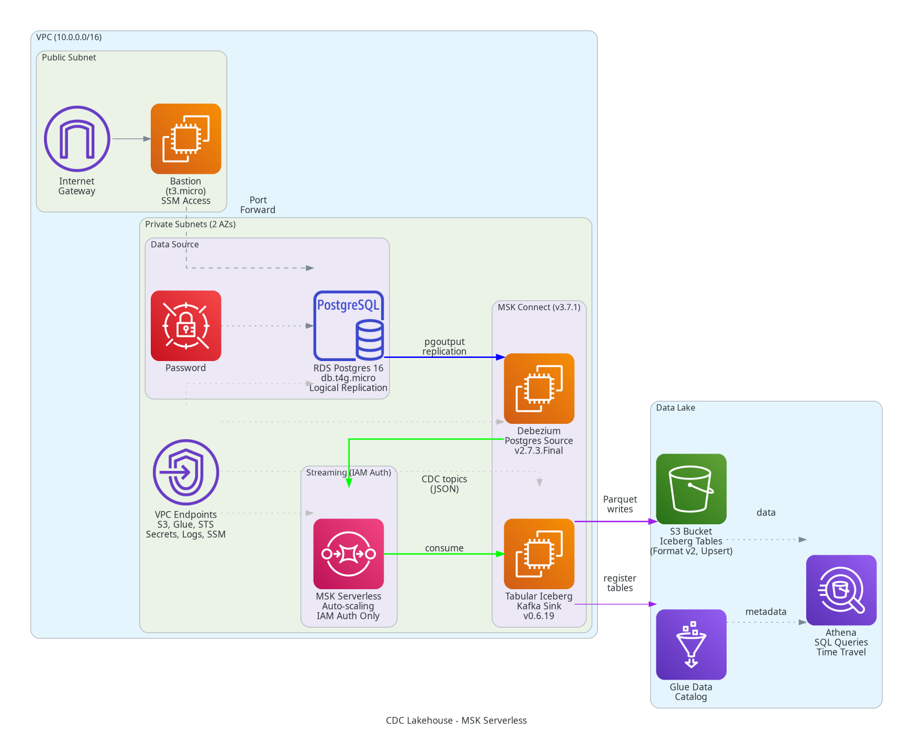

# AWS CDC Lakehouse Starter

A production-quality reference implementation for Change Data Capture (CDC) into an Apache Iceberg data lakehouse on AWS. Captures changes from RDS Postgres in near real-time (1-2 minute latency) and makes them queryable via Athena.

**Architecture**: RDS Postgres (logical replication) → Debezium on MSK Connect → Amazon MSK Serverless → Iceberg Sink on MSK Connect → S3 (Iceberg tables) → Glue Data Catalog → Athena

## What This Is

This is a **working, honest reference** for platform and data engineers who want to understand CDC lakehouses on AWS or need a foundation to customize. It demonstrates:

- End-to-end CDC from a transactional database to a queryable lakehouse
- Debezium's pgoutput-based replication (no custom plugins in RDS)
- Apache Iceberg format v2 with upsert semantics (updates and deletes)
- MSK Connect with proper IAM scoping and CloudWatch logging
- Terraform infrastructure that can be deployed, tested, and cleanly destroyed
- Realistic connectivity (private VPC, no NAT gateway, SSM-based database access)
- Smoke tests that prove insert/update/delete propagation with measured latency

## Who This Is For

- **Platform/MLOps engineers** building or evaluating CDC pipelines on AWS
- **Data engineers** learning Debezium, Kafka Connect, or Iceberg
- **Architects** assessing AWS-managed streaming and lakehouse patterns

This is a **portfolio-quality reference**, not a toy. Every configuration choice is documented, every compatibility claim is verified, and all limitations are stated honestly.

## When to Use This

Use this starter when:

- You need a working CDC reference to learn from or fork
- You want to prototype a CDC lakehouse without multi-account complexity
- You need a known-good baseline before customizing connectors or schemas
- You're evaluating MSK Connect vs. self-hosted Kafka Connect

## When NOT to Use This

Do not use this as-is for production:

- **Single AWS account**: No environment separation
- **Single Postgres source**: No multi-source or heterogeneous replication
- **No schema registry**: Events are plain JSON without schema enforcement
- **Minimal security**: Simplified IAM, no encryption at rest with CMKs, no VPC Flow Logs
- **No observability**: Basic CloudWatch logs, no tracing or alerting
- **No HA/DR**: Single-region, no automated failover or backup/restore workflows

This is v0.1.0—a solid foundation, not a complete production system.

## Architecture



### Data Flow

1. **RDS Postgres** with logical replication publishes changes via the `pgoutput` plugin
2. **Debezium Postgres Connector** (v2.7.3.Final) on MSK Connect captures changes and emits Kafka events
3. **Amazon MSK Serverless** (IAM auth, auto-scaling) brokers the change stream with one topic per table
4. **Tabular Iceberg Kafka Connect Sink** (v0.6.19) consumes events, handles the Debezium envelope, and writes Iceberg tables
5. **S3 + Glue Data Catalog** store Iceberg metadata and Parquet data files
6. **Athena** queries the lakehouse with SQL, including Iceberg time-travel queries

### Connectivity

- **Private VPC** with no NAT gateway (cost optimization)
- **VPC Endpoints**: S3 Gateway, plus Interface endpoints for Glue, STS, Secrets Manager, CloudWatch Logs, SSM
- **Bastion**: Tiny EC2 instance in a public subnet for SSM Session Manager port forwarding to RDS
- **MSK Connect** runs in private subnets with IAM-based Kafka authentication

## Architecture Decisions

### Why MSK Serverless?

**MSK Connect DOES support MSK Serverless** ([AWS MSK Connect documentation](https://docs.aws.amazon.com/msk/latest/developerguide/msk-connect.html), verified 2026-09-28). Quote: "MSK Connect supports connectors for any Apache Kafka cluster with connectivity to an Amazon VPC, whether it is an MSK cluster or an independently hosted Apache Kafka cluster."

MSK Serverless provides:
- **No broker management**: Auto-scaling capacity, no instance types to choose
- **IAM-only authentication**: Simplified security model (no SASL/SCRAM or ACLs)
- **Pay-per-use**: Cluster-hour + partition-hour pricing (~$0.77/hr for this starter)
- **Operational simplicity**: Perfect for prototypes and dev environments

**Limitations**:
- **No auto-topic creation**: Topics must be explicitly created (handled by `scripts/create-topics.sh`)
- **Partition limits**: 2,400 for non-compacted topics, 120 for compacted (Kafka Connect internals are compacted)
- **Throughput per partition**: 5 MB/s in, 10 MB/s out (sufficient for CDC)

For production, evaluate provisioned MSK if you need:
- Broker-level configuration control
- More than 120 compacted topic partitions
- Predictable monthly costs vs. usage-based billing

### Why pgoutput Instead of wal2json or decoderbufs?

The `pgoutput` logical decoding plugin is **built into Postgres 10+** and does not require installing extensions in RDS. It is Debezium's recommended plugin for RDS Postgres ([Debezium Postgres docs](https://debezium.io/documentation/reference/stable/connectors/postgresql.html), verified 2026-09-28).

### Why MSK Connect Instead of Self-Hosted Kafka Connect?

MSK Connect is **fully managed**: AWS handles worker provisioning, scaling, patching, and integration with IAM and CloudWatch. For this reference, managed simplicity outweighs the flexibility of self-hosted workers. The Terraform here provisions and configures custom plugins automatically.

### Why Iceberg Format v2?

Iceberg v2 supports **row-level deletes and updates** via delete files, which the Iceberg sink uses to handle Debezium's delete events. Format v1 only supports append and overwrite, making CDC updates inefficient.

### Why Interface VPC Endpoints?

MSK Connect and the connectors need to call AWS APIs (Glue, Secrets Manager, STS, CloudWatch Logs) from private subnets. Interface endpoints ($0.01/AZ-hour each) replace a NAT Gateway ($0.045/hour + data transfer), and this stack needs 7-8 endpoints. The hourly cost is higher than a NAT, but the design is simpler and the test duration is short. For long-running production use, evaluate NAT Gateway + fewer endpoints.

## Prerequisites

- **AWS Account** with admin-equivalent permissions (the test runs as root user, cannot assume roles)
- **AWS CLI** (v1 or v2) configured with credentials
- **Terraform** >= 1.5.0
- **PostgreSQL client** (`psql`)
- **Python 3.9+** with `boto3`, `psycopg2`
- **Session Manager plugin** for AWS CLI ([installation guide](https://docs.aws.amazon.com/systems-manager/latest/userguide/session-manager-working-with-install-plugin.html))

macOS compatibility: Tested on macOS with default bash 3.2 and older GNU make. No bashisms or GNU-specific flags.

## Quickstart

### 1. Pre-flight Check

```bash
make doctor
```

Validates:
- AWS credentials and region
- Required tools and versions
- Service quotas
- Terraform configuration
- Estimated hourly cost (~$0.54/hour, ~$0.60 for a 1-hour test)

### 2. Deploy Infrastructure

```bash
make apply
```

Provisions:
- VPC, subnets, security groups, VPC endpoints
- RDS Postgres with logical replication enabled
- MSK cluster with IAM auth and broker logging
- MSK Connect custom plugins (Debezium, Iceberg) uploaded to S3
- Two MSK Connect connectors (Debezium source, Iceberg sink)
- Glue Data Catalog database
- Athena workgroup and named queries
- Bastion instance for database access

**Expected duration**: 20-25 minutes (MSK cluster creation is the longest step)

### 3. Seed the Database

```bash
make seed
```

Creates:
- Schema: `customers`, `orders`, `order_items` tables with primary keys
- Postgres publication `cdc_publication` for the three tables
- Seed data: 5 customers, 5 orders, 8 order items

**Expected duration**: 30-60 seconds

Debezium will snapshot the tables and then switch to streaming mode. The Iceberg sink will consume the snapshot events and create Iceberg tables in S3.

### 4. Smoke Test

```bash
make smoke
```

End-to-end verification:
1. Inserts a row with a unique marker in Postgres
2. Polls Athena until the row appears (max 5 minutes)
3. Updates the row and verifies the update in Athena
4. Deletes the row and verifies the deletion in Athena

Reports measured latency for each operation.

**Expected duration**: 3-6 minutes (depends on Kafka Connect flush intervals and Athena query time)

**Typical latencies**: 30-120 seconds for inserts, updates, and deletes to appear in Athena.

### 5. Load Generator (Optional)

```bash
make load
```

Runs a Python load generator that performs random inserts, updates, and deletes at a configurable rate (default: 10 ops/sec for 60 seconds). Useful for observing steady-state behavior.

### 6. Query the Lakehouse

Use the AWS Console or CLI to run Athena queries. Named queries are pre-created:

- `cdc-lakehouse_orders_per_customer`: Orders and revenue per customer
- `cdc-lakehouse_revenue_by_day`: Daily revenue summary
- `cdc-lakehouse_top_selling_items`: Top items by revenue
- `cdc-lakehouse_time_travel_example`: Iceberg time-travel examples

To query from the CLI:

```bash
aws athena start-query-execution \
  --query-string "SELECT * FROM customers LIMIT 10" \
  --query-execution-context "Database=cdc-lakehouse_lakehouse" \
  --work-group "cdc-lakehouse-workgroup" \
  --region us-east-1
```

### 7. Destroy Infrastructure

```bash
make destroy
```

Tears down all resources. RDS has `skip_final_snapshot = true` and `deletion_protection = false` for easy cleanup.

**Expected duration**: 10-15 minutes

### 8. Verify Clean Teardown

```bash
make verify-clean
```

Independently checks that no billable resources remain:
- RDS instances and snapshots
- MSK cluster and connectors
- VPC interface endpoints
- S3 buckets
- Glue databases
- Secrets Manager secrets
- EC2 instances

Also explains Debezium replication slot behavior and WAL growth risks.

## Cost Breakdown

Based on **AWS us-east-1 pricing as of 2026-09-28** ([pricing pages verified](https://aws.amazon.com/pricing/)):

| Resource | Cost | Pricing Page (verified 2026-09-28) |
|----------|------|----------------------------------|
| RDS db.t4g.micro | ~$0.016/hour | [RDS Pricing](https://aws.amazon.com/rds/postgresql/pricing/) |
| RDS storage (20 GB gp3) | ~$0.003/hour | [RDS Pricing](https://aws.amazon.com/rds/postgresql/pricing/) |
| MSK Serverless cluster-hour | $0.75/hour | [MSK Pricing](https://aws.amazon.com/msk/pricing/) |
| MSK Serverless partition-hours (15) | ~$0.023/hour | [MSK Pricing](https://aws.amazon.com/msk/pricing/) |
| MSK Connect (2 MCU) | ~$0.22/hour | [MSK Connect Pricing](https://aws.amazon.com/msk/pricing/) |
| EC2 t3.micro bastion | ~$0.0104/hour | [EC2 Pricing](https://aws.amazon.com/ec2/pricing/on-demand/) |
| Interface endpoints (6 × 2 AZs) | ~$0.12/hour | [VPC Pricing](https://aws.amazon.com/vpc/pricing/) |
| S3 storage | ~$0.023/GB/month | [S3 Pricing](https://aws.amazon.com/s3/pricing/) |
| Athena queries | ~$5/TB scanned | [Athena Pricing](https://aws.amazon.com/athena/pricing/) |
| CloudWatch Logs | ~$0.50/GB ingested | [CloudWatch Pricing](https://aws.amazon.com/cloudwatch/pricing/) |

**Total estimated hourly cost**: ~$1.14/hour  
**Estimated cost for 1-hour test**: ~$1.20

**MSK Serverless breakdown**:
- Cluster-hour: $0.75
- 15 partition-hours (5 compacted + 15 non-compacted partitions): 15 × $0.0015 = $0.0225
- Data transfer charges minimal for test workloads

**After `make destroy`**: Cost drops to ~$0 within minutes. S3 and CloudWatch Logs charges are minimal unless you store large amounts of data or logs.

## Runbooks

See `docs/runbooks/` for operational procedures:

- **[Schema Changes](docs/runbooks/schema-changes.md)**: Adding/removing columns in Postgres, Iceberg schema evolution behavior, and limitations
- **[Connector Restart](docs/runbooks/connector-restart.md)**: Stop/restart the Iceberg sink, verify it resumes from committed offsets without data loss or duplicates
- **[Replay from Beginning](docs/runbooks/replay.md)**: Reset the Iceberg sink consumer group to replay all events for a table
- **[Replication Slot Management](docs/runbooks/replication-slot.md)**: Monitor and manage Debezium's replication slot, WAL growth risks, and cleanup

## Limitations

### Connector Versions

- **Debezium 2.5.4.Final**: Compatible with Kafka 3.5.x (MSK Connect runtime 2.7.1 uses Kafka 3.5.1)
- **Iceberg Kafka Connect 1.4.3**: Compatible with Kafka Connect 3.5.x and Iceberg 1.4.x

### Schema Changes

- **Adding columns**: Debezium captures the change; Iceberg sink evolves the schema (adds nullable column)
- **Dropping columns**: Debezium omits the column from new events; old Iceberg columns remain (nullable, filled with nulls for new rows)
- **Renaming columns**: Treated as drop + add by Debezium; Iceberg sees a new column (data migration required)
- **Changing column types**: Often requires manual intervention and table rebuild

**Recommendation**: Test schema changes in a non-production environment first. The Iceberg sink's schema evolution is limited compared to a schema registry + Avro.

### No Schema Registry

Events are plain JSON without a schema registry (Confluent Schema Registry or AWS Glue Schema Registry). This simplifies the v0.1.0 stack but limits schema governance and compatibility checking.

### Single Table per Topic

Debezium is configured with `table.include.list` for three tables. Each table gets its own Kafka topic. This is the standard pattern for Debezium but may result in many topics for databases with hundreds of tables.

### Replication Slot Growth

Debezium creates a replication slot (`debezium_slot`) in RDS. If the connector stops consuming, the slot holds WAL segments, which can grow disk usage and eventually fill storage. Monitor replication slot lag and WAL usage. See `docs/runbooks/replication-slot.md`.

### IAM Scoping

IAM roles are scoped to:
- Specific MSK cluster ARN
- Specific topic patterns (e.g., `debezium-*`, `iceberg-*`)
- Specific S3 bucket prefixes
- Specific Glue database

This is **not least-privilege** in all cases (e.g., VPC permissions are `Resource: "*"`), but it is more scoped than many public examples. For production, audit and tighten further.

### No Encryption with CMKs

S3 and RDS use AWS-managed keys (SSE-S3, default RDS encryption). For production, use customer-managed KMS keys.

### No Monitoring or Alerting

Connector logs go to CloudWatch Logs, but there are no CloudWatch Alarms, dashboards, or tracing. For production, add:
- MSK Connect connector state alarms
- RDS replication slot lag alarms
- MSK under-replicated partition alarms
- Athena query cost and performance tracking

### Bastion Access

The bastion is in a public subnet with SSM Session Manager for port forwarding. For production, consider AWS Client VPN or a more hardened bastion with session recording and MFA.

## Security Notes

- **RDS password**: Managed by RDS and stored in Secrets Manager (no plaintext in Terraform state)
- **Kafka authentication**: IAM-based (no plaintext credentials)
- **Connector credentials**: MSK Connect uses the Secrets Manager config provider to fetch the RDS password at runtime
- **S3 encryption**: SSE-S3 (AWS-managed keys)
- **VPC**: All data services (RDS, MSK, MSK Connect) are in private subnets with no direct internet access
- **Security groups**: Ingress limited to required ports and source security groups
- **IMDSv2**: Bastion instance requires IMDSv2

## Troubleshooting

### Connectors Not Running

Check MSK Connect connector status:

```bash
aws kafkaconnect list-connectors --region us-east-1
aws kafkaconnect describe-connector --connector-arn <arn> --region us-east-1
```

Check CloudWatch Logs:

```bash
aws logs tail /aws/msk-connect/cdc-lakehouse-debezium- --follow --region us-east-1
aws logs tail /aws/msk-connect/cdc-lakehouse-iceberg- --follow --region us-east-1
```

Common issues:
- **Debezium fails to connect**: Check RDS security group, Secrets Manager secret ARN, and IAM permissions
- **Iceberg sink fails**: Check Glue permissions, S3 permissions, and topic names

### Data Not Appearing in Athena

1. Check Debezium is capturing changes: query the MSK topic or check Debezium logs
2. Check Iceberg sink consumer lag: look for `lag` metrics in CloudWatch or connector logs
3. Verify Glue tables exist: `aws glue get-tables --database-name cdc-lakehouse_lakehouse`
4. Run Athena query and check for errors in the Athena console

### Replication Slot Growth

If the Debezium connector stops, the replication slot will hold WAL segments. Monitor:

```sql
SELECT slot_name, active, pg_size_pretty(pg_wal_lsn_diff(pg_current_wal_lsn(), restart_lsn)) AS lag
FROM pg_replication_slots;
```

If lag grows beyond a few GB, consider:
- Restarting the Debezium connector
- Dropping and recreating the slot (requires resnapshot)
- Increasing RDS storage temporarily

See `docs/runbooks/replication-slot.md` for details.

## Development

### Terraform

```bash
make format      # Format Terraform files
make validate    # Validate configuration
```

### Linting

```bash
make lint        # Run shellcheck and Python linters
```

### Testing

```bash
make test        # Run Python unit tests
```

### Render Architecture Diagram

```bash
make render-diagram
```

Requires `pip3 install diagrams graphviz` and Graphviz installed (`brew install graphviz` on macOS, `apt install graphviz` on Debian/Ubuntu).

## Project Structure

```
.
├── terraform/              # Terraform root module
│   ├── modules/           # Terraform modules
│   │   ├── athena/
│   │   ├── glue/
│   │   ├── iam/
│   │   ├── msk/
│   │   ├── msk-connect/
│   │   ├── networking/
│   │   └── rds/
│   ├── main.tf
│   ├── variables.tf
│   ├── outputs.tf
│   └── versions.tf
├── scripts/               # Operational scripts
│   ├── doctor.sh          # Pre-flight checks
│   ├── seed.sh            # Schema and seed data
│   ├── smoke.sh           # End-to-end test
│   ├── load_generator.py  # Load generator
│   └── verify-clean.sh    # Post-destroy verification
├── docs/                  # Documentation
│   ├── architecture.py    # Architecture diagram generator
│   ├── architecture.png   # Generated diagram
│   └── runbooks/          # Operational runbooks
├── tests/                 # Unit tests
├── Makefile               # Build automation
├── README.md              # This file
├── CHANGELOG.md           # Version history
└── LICENSE                # MIT license
```

## Contributing

This is a reference starter, not a framework. Fork it, customize it, and make it your own. If you find bugs or compatibility issues, please open an issue with:
- AWS service versions and regions
- Terraform version
- Error messages and logs

## License

MIT License. See [LICENSE](LICENSE).

## Changelog

See [CHANGELOG.md](CHANGELOG.md).

## References

- [Debezium Postgres Connector](https://debezium.io/documentation/reference/stable/connectors/postgresql.html)
- [Apache Iceberg Kafka Connect](https://iceberg.apache.org/docs/latest/kafka-connect/)
- [AWS MSK Connect](https://docs.aws.amazon.com/msk/latest/developerguide/msk-connect.html)
- [AWS MSK](https://docs.aws.amazon.com/msk/latest/developerguide/what-is-msk.html)
- [Terraform AWS Provider](https://registry.terraform.io/providers/hashicorp/aws/latest/docs)

---

**Version**: 0.1.0  
**Author**: Platform/MLOps Engineer Portfolio Piece  
**Last Updated**: December 2024
